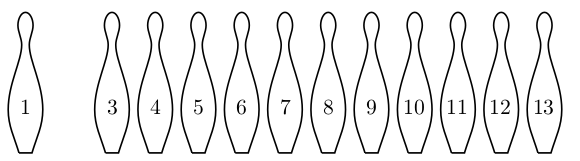

# Bowling Pins

Link: https://www.hackerrank.com/challenges/bowling-pins/problem?isFullScreen=false

A bowling olyan sport, ahol a játékos egy bowlinggolyót gurít egy bábu-csoport felé, célja pedig az, hogy ledöntse a pálya végén álló bábukat.

Ebben a kihívásban a játék szabályait kissé módosítottuk. Most adott számú bábu van és vízszintes sorban helyezkednek el, nem pedig háromszög alakban, ahogy a hagyományos bowlingban. Két játékos játszik, váltakozva dobva. Az nyer, aki ledönti az utolsó bábut vagy bábukat.

Te játszol a barátoddal. Egy dobással ledönthetsz egy bábut, vagy két szomszédos bábut, de csak ezek a lépések engedélyezettek. Néhány lépést már megtettetek. Hirtelen rájössz, hogy meg lehet határozni, hogy megnyerhető-e a játék, feltételezve az optimális játékot. És szerencsére most rajtad a sor.

Egy konfiguráció egy `X` és `I` betűkből álló karakterlánccal van ábrázolva, ahol:
- `I` azt jelenti, hogy az adott pozícióban bábu áll.
- `X` azt jelenti, hogy az adott pozícióból már kidőlt a bábu.

Egy példa egy ilyen konfigurációra az alábbi ábrán látható. Itt a bábuk száma 13, és a 2. bábu már kidőlt.

Ezt a következő konfigurációval reprezentáljuk: `IXIIIIIIIIIII`.

## Feladat
Egészítsd ki az `isWinning` függvényt, amely megkapja a bábuk számát és a bábuk konfigurációját bemenetként, és térjen vissza `WIN` vagy `LOSE` értékkel attól függően, hogy megnyered-e a játékot.

### Szabályok
- Egy dobással egy bábut, vagy két szomszédos bábut lehet ledönteni.
- Egy játékosnak minden körben legalább egy bábut le kell döntenie.
- Mindkét játékos optimálisan játszik.

---

## Bemeneti formátum
Az első sor tartalmaz egy `T` egész számot, amely a tesztesetek számát adja meg. Ezután következik `T` teszteset.

Minden teszteset első sora egyetlen `N` egész számot tartalmaz, amely a bábuk számát jelzi. A második sor egy `N` hosszú karakterláncot tartalmaz, amely minden betűje `I` vagy `X`.

### Korlátozások

- 1 ≤ `T` ≤ 1000
- 1 ≤ `N` ≤ 300
- A karakterlánc (a konfiguráció reprezentációja) minden betűje `I` vagy `X`.
- A karakterláncban legalább egy `I` van.

---

## Kimeneti formátum
Minden tesztesethez nyomtasd ki a `WIN` értéket, ha megnyered a játékot, különben a `LOSE` értéket.

---

## Példa Bemenet
4  
4  
IXXI  
4  
XIIX  
5  
IIXII  
5  
IIIII

## Példa Kimenet
LOSE  
WIN  
LOSE  
WIN

## Magyarázat

- **1. teszteset:** Mivel a bábuk nem szomszédosak, egyszerre csak egy bábut dönthetsz le. Ezután a barátod ledönti az utolsó bábut.
- **2. teszteset:** Egyszerre két bábut is le tudsz dönteni.
- **3. teszteset:** Az egyik vagy a másik oldalról ledönthetsz egy vagy két bábut, de a barátod mindig tükrözi a lépésedet, így az utolsó mozdulat az övé lesz.
- **4. teszteset:** Ledöntheted a középső bábut, így a konfiguráció `IIXII` lesz. Ez megegyezik az előző tesztesettel, de most a barátod kezd, és te másolhatod az ő mozdulatát.

[http://hr-challenge-images.s3.amazonaws.com/2526/pins.png]: http://hr-challenge-images.s3.amazonaws.com/2526/pins.png
