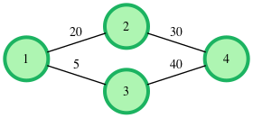

# Jack goes to Rapture

Link: https://www.hackerrank.com/challenges/jack-goes-to-rapture/problem?isFullScreen=false

Jack nemrég költözött egy új városba, amit Rapture-nek hívnak. Tömegközlekedési eszközt szeretne használni. A viteldíjszabályok a következők:

- Minden összekapcsolt állomáspárhoz van egy viteldíj rendelve, az utazás irányától függetlenül.
- Ha Jack A állomásról B állomásra utazik, akkor csak a különbséget kell kifizetnie az (A és B közötti viteldíj) és (az A állomás eléréséhez kifizetett összes viteldíj) között: [fare(A,B) - összes viteldíj A állomásig]. Ha a különbség negatív, az utazás A-tól B-ig ingyenes.

Jack pénzszűkében van, és a segítségedre van szüksége, hogy kitalálja a leggazdaságosabb útvonalat az első állomástól az utolsó állomásig eljutni. Adott az állomások száma: ***g_nodes*** (**1**-től ***g_nodes***-ig számozva) és az egymással összekötött állomáspárok (***g_edges***) közötti viteldíjak (súlyok). Határozd meg az első állomástól az ***g_nodes***-ig tartó legalacsonyabb viteldíjat.

### Példa

***g_nodes*** **= 4**  
***g_from*** **= [1,1,2,3]**  
***g_to*** **= [2,3,4,4]**  
***g_weight*** **= [20,5,30,40]**  

A gráf így néz ki:

Az utazás az 1-es állomástól a 2-es állomáson keresztül a 4-es állomásig 20 egységbe kerül az első szakaszon (1 → 2), majd a költségkülönbség 30 - 20 = 10 egység a további szakaszra. Az összköltség így 30 egység.
Az utazás az 1-es állomástól a 3-as állomáson keresztül a 4-es állomásig 5 egységbe kerül az első szakaszon (1 → 3), majd további 40 - 5 = 35 egység a további szakaszra. Az összköltség így 40 egység.
A kedvezőbb opció költsége 30 egység.

### Függvény leírása

Készítsd el a getCost függvényt a következő paraméterekkel:

- *int g_nodes*: az állomáshálózatban lévő állomások száma  
- *int g_from[g_edges]*: Kétirányú kapcsolat végeinek állomásai  
- *int g_to[g_edges]*: A g_from[i] állomás összeköttetésben áll a g_to[i] állomással a g_weight[i] költséggel.
- *int g_weight[g_edges]*: az állomások közötti utazás költsége  

### Kimenet

- int vagy string: az **1**-es állomástól a ***g_nodes*** állomásig vezető legalacsonyabb költségű útvonal költsége, vagy NO PATH EXISTS (ha nincs elérhető útvonal).  
Nincs visszatérési érték.

### Bemeneti formátum

- Az első sor két szóközökkel elválasztott egész számot tartalmaz: ***g_nodes*** és ***g_edges***, az állomások száma és a közöttük lévő kapcsolatok száma.
- A következő ***g_edges*** sor mindegyike három szóközökkel elválasztott egész számot tartalmaz: ***g_from***, ***g_to*** és ***g_weight***, a kapcsolódó állomásokat és a közöttük lévő viteldíjat.

### Korlátozások

- **1 ≤ *g_nodes* ≤ 50000**
- **1 ≤ *g_edges* ≤ 500000**
- **1 ≤ *g_weight[i]* ≤ 10^7**

### Példa bemenet 1

5 5  
1 2 60  
3 5 70  
1 4 120  
4 5 150  
2 3 80  

### Példa kimenet 1

80  

### Magyarázat 1

Kétféleképpen lehet eljutni az első állomástól az utolsó állomásig:

- **1 -> 2 -> 3 -> 5**
- **1 -> 4 -> 5**

Az első útvonalnál Jack először **60** egység viteldíjat fizet, hogy eljusson az **1**-es állomásról a **2**-esre. Ezután Jacknek **80 - 60 = 20** egységet kell fizetnie, hogy eljusson a **2**-esről a **34**-esre. Most, hogy eljusson a **3**-as állomásról az **5**-ösre, Jacknek **70 - (60 + 20) = -10** egységet kellene fizetnie, de mivel ez negatív érték, Jack **0** egységet fizet, hogy eljusson a **3**-asról az **5**-ösre. Így az útvonal teljes költsége **(60 + 20) = 80** egység.

A második útvonalnál Jack **120** egységet fizet, hogy eljusson az **1**-es állomásról a **4**-esre. Ahhoz, hogy a **4**-esről az **5**-ösre utazzon, Jacknek **150 - 120 = 30** egységet kell fizetnie. Így az összköltség **(120 + 30) = 150** egység. Tehát az első útvonal a legolcsóbb, **80** egység költséggel.

### Példa bemenet 2

5 6  
1 2 30  
3/3  
2 3 50  
3 4 70  
4 5 90  
1 3 70  
3 5 85

### Példa kimenet 2

85

### Magyarázat 2

Az utazás az **1**-es csúcsnál kezdődik, és két útvonal is vezet a **3**-as csúcsig, amelyek költsége vagy **50**, vagy **70**. Ha az útvonalat a **3**-asról a **4**-esen keresztül az **5**-ösre választjuk, a költség **90**-ra emelkedik, míg ha közvetlenül a **3**-asról az **5**-ösre utazunk, csak **85** egységet kell fizetnünk.
